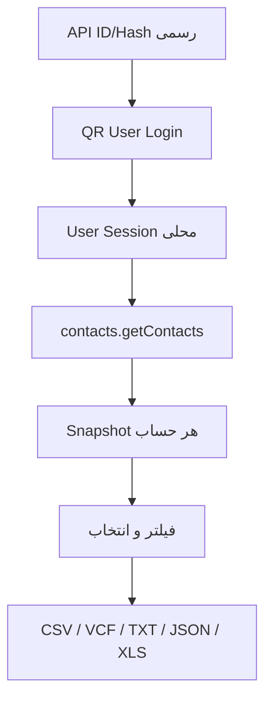

# معماری ContactFlow Personal Ultimate 3.4

## هسته مشترک

پوشه `web/` Source of Truth رابط نسخه ۳.۴ است. `import-merge.js` موتور خالص و تست‌پذیر و `v34.js` هماهنگ‌کننده UI/IndexedDB/Device API است. Workflow انتشار Connector را Build می‌کند و همان خروجی را بدون Fork شدن منطق در همه پوسته‌ها قرار می‌دهد:

- Telegram Mini App / cPanel
- PWA و مرورگر
- Android WebViewAssetLoader
- Windows، Linux و macOS Go shell

هسته مشترک شامل مدیریت مخاطبین، Import/Export، Audience، Campaign، Backup، Activity، صفحه Telegram Contacts و Diagnostics است.

## ذخیره‌سازی محلی

دیتابیس اصلی `contactflow_pwa_v2` داده‌های ContactFlow را نگه می‌دارد. Telegram User API دیتابیس جداگانه `contactflow_telegram_web_v1` دارد تا Session و Snapshot با Backup عادی مخلوط نشوند.

### دیتابیس اصلی

- `contacts`
- `imports`
- `meta`
- `settings`
- `artifacts`
- `contact_flags`
- `campaigns`
- `ad_requests`
- `telegram_accounts` برای Metadata قدیمی و غیرحساس
- `templates`
- `activity`
- `merge_runs`: Delta لازم برای Undo/Rollback و گزارش Merge
- `contact_images`: عکس‌های ZIP/OCR مرتبط با Import
- `watch_state`: Handle و آخرین وضعیت پوشه انتخاب‌شده

### دیتابیس Telegram

- `accounts`: Metadata حساب و Session رمزگذاری‌شده
- `keys`: کلید non-extractable WebCrypto
- `contacts`: Snapshot مجزا برای هر حساب
- `checks`: نتایج Checker مجاز
- `history`: Duplicate-send guard
- `meta`: حساب فعال و زمان Sync

## مسیر مخاطبین Telegram

Mini App به Session داخلی Telegram دسترسی ندارد. Bot API و `requestContact` نیز دفترچه مخاطبین را برنمی‌گردانند؛ بنابراین User Session مستقل یک مرز فنی الزامی است.

## مدل امنیتی

- اطلاعات اصلی Local-First است و ContactFlow Account Server وجود ندارد.
- Session Telegram با AES-GCM و کلید WebCrypto همان Origin در حالت ذخیره رمز می‌شود.
- API credentials محلی برای Scriptهای همان Origin قابل دسترسی است؛ Deployment باید HTTPS و قابل اعتماد باشد.
- Session و Snapshot داخل `.cfbackup` اصلی قرار نمی‌گیرند.
- Build می‌تواند credentials را از GitHub Secrets داخل Artifact تزریق کند یا آن‌ها را خالی بگذارد تا هر کاربر credentials خودش را محلی وارد کند.

## پوسته‌های دستگاه

Android خروجی فایل را با System Document Picker ذخیره می‌کند. Desktop هسته را Embed و روی یک Port محلی تصادفی اجرا می‌کند. PWA و Mini App از Download/Web Share استفاده می‌کنند. Service Worker فقط درخواست‌های GET همان Origin را Cache می‌کند.

## انتشار

`.github/workflows/release-all.yml` تست‌ها را اجرا، Connector را Build، Web Core را Assemble و خروجی‌های زیر را از همان Commit منتشر می‌کند:

- PWA ZIP
- Windows Portable و Setup
- Linux x64
- macOS Intel و Apple Silicon
- Android APK
- Telegram Mini App cPanel ZIP
- Source ZIP، Release info و SHA-256
